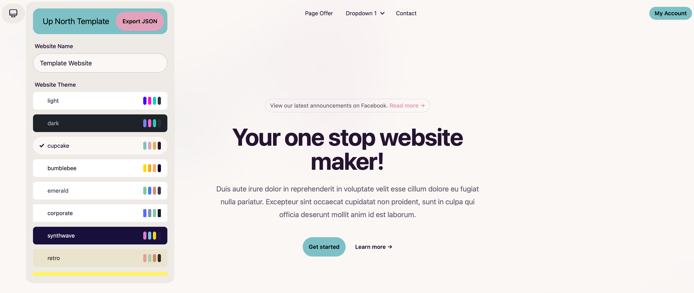

# up-north-template

- Follow how to set up Angular website in README in template-app.
- Edit template-app/src/data.json to customize your website.
- Export JSON to see changes in data.json.
- Profit.



## Working with repo
1. Push changes.
1. Changes should be picked up by GitHub Actions.

## Manual Builds
1. Build for GitHub: ```ng build --base-href /up-north-template --deploy-url /up-north-template/```
   - Current Directory must be within ```./template-app```
1. Deploy to AWS
   - See [infrastructure README.md](./infrastructure/README.md) for more.
   1. ```npm run build```
   1. ```npm run synth -- --context name=test-com```
   1. ```npm run deploy -- --context name=test-com```
   1. Destroy from AWS
      1. ```npm run destroy -- --context name=test-com```
